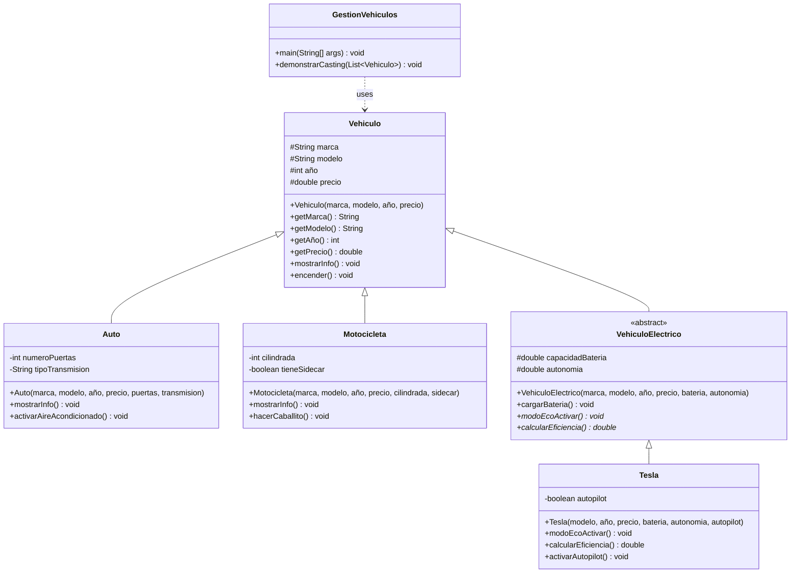

# Laboratorio 01: Repaso POO

- **Curso**: Ingeniería de Software II
- **Aula**: 851
- **Fecha**: 20/08/2025
- **Jefe de prácticas**: Sebastián Chávarry

---

## 📖 Caso de Estudio: Sistema de Gestión Vehicular

Una empresa de alquiler de vehículos necesita un sistema para gestionar su flota. La flota incluye autos tradicionales, motocicletas y vehículos eléctricos (específicamente Teslas). Cada tipo de vehículo tiene características y comportamientos únicos, pero todos comparten propiedades básicas como marca, modelo, año y precio.

### Requisitos del Sistema:

- **Vehículos base:** Todos tienen información básica y pueden encenderse
- **Autos:** Tienen número de puertas, tipo de transmisión y aire acondicionado
- **Motocicletas:** Tienen cilindrada, pueden tener sidecar y hacer caballitos
- **Vehículos eléctricos:** Tienen batería, autonomía y modos especiales (abstractos)
- **Teslas:** Implementan funciones específicas como autopilot y modo eco

> **Objetivo**: Refrescar conceptos de POO, herencia, clases abstractas y polimorfismo

---

## 📊 Diagrama de Clases


```mermaid
classDiagram
    class Vehiculo {
        #String marca
        #String modelo
        #int año
        #double precio
        +Vehiculo(marca, modelo, año, precio)
        +getMarca() String
        +getModelo() String
        +getAño() int
        +getPrecio() double
        +mostrarInfo() void
        +encender() void
    }

    class Auto {
        -int numeroPuertas
        -String tipoTransmision
        +Auto(marca, modelo, año, precio, puertas, transmision)
        +mostrarInfo() void
        +activarAireAcondicionado() void
    }

    class Motocicleta {
        -int cilindrada
        -boolean tieneSidecar
        +Motocicleta(marca, modelo, año, precio, cilindrada, sidecar)
        +mostrarInfo() void
        +hacerCaballito() void
    }

    class VehiculoElectrico {
        <<abstract>>
        #double capacidadBateria
        #double autonomia
        +VehiculoElectrico(marca, modelo, año, precio, bateria, autonomia)
        +cargarBateria() void
        +modoEcoActivar()* void
        +calcularEficiencia()* double
    }

    class Tesla {
        -boolean autopilot
        +Tesla(modelo, año, precio, bateria, autonomia, autopilot)
        +modoEcoActivar() void
        +calcularEficiencia() double
        +activarAutopilot() void
    }

    class GestionVehiculos {
        +main(String[] args) void
        +demonstrarCasting(List~Vehiculo~) void
    }

    Vehiculo <|-- Auto
    Vehiculo <|-- Motocicleta
    Vehiculo <|-- VehiculoElectrico
    VehiculoElectrico <|-- Tesla
    GestionVehiculos ..> Vehiculo : uses
```

### Leyenda del Diagrama:

- `+` = public
- `#` = protected
- `-` = private
- `*` = método abstracto
- `<<abstract>>` = clase abstracta
- `<|--` = herencia
- `..>` = dependencia/uso

---

## Preparación

<figure>
  
  <figcaption>Paso 00: Crear el proyecto</figcaption>
</figure>

<figure>
  
  <figcaption>Paso 01: Crear un proyecto de Maven</figcaption>
</figure>

<figure>
  
  <figcaption>Paso 02: Ingresar el nombre del proyecto</figcaption>
</figure>

<figure>
  
  <figcaption>Paso 03: Se ha creado el proyecto con una clase main por defecto</figcaption>
</figure>

<figure>
  
  <figcaption>Paso 04: Analizamos el POM</figcaption>
</figure>

## ¿Cómo crear clases?

<figure>
  
  <figcaption>Paso 05: Click derecho en el package para crear una nueva clase de Java </figcaption>
</figure>

<figure>
  
  <figcaption>Paso 06: Ingresamos el nombre de nuestra clase </figcaption>
</figure>

<figure>
  
  <figcaption>Paso 07: Una vez creada la clase, escribimos los atributos damos Click Derecho y nos saldrán opciones. Nos centramos en la principal "Insert Code" </figcaption>
</figure>

<figure>
  
  <figcaption>Paso 08: NetBeans nos facilita dandonos código predefinido, de lo cual podemos destacar el Constructor, Setters, Getters y Override Method </figcaption>
</figure>

## ¿Cómo creamos clases hijas ?

<figure>
  
  <figcaption>Paso 09: SuperClass = Clase Padre. Netbeans por defecto nos permite asociar una clase nueva creada con su clase Padre. </figcaption>
</figure>

<figure>
  
  <figcaption>Paso 10: Por defecto, debería salirnos error, porque según la teoría las clases hijas deben tener implementado el método Constructor con los parámetros del método constructor Padre. </figcaption>
</figure>

<figure>
  
  <figcaption>Paso 11: En caso queramos sobreescribir un método de una clase padre. Por ejemplo, en este caso el método <code>mostrarInfo()</code> , tenemoers que utilizar la etiqueta <code>@Override.</code> </figcaption>
</figure>

## ¿Cómo implementamos métodos abstractos de una clase abstracta?

<figure>
  
  <figcaption>Paso 12: Cuando declaramos que un método es abastract utilizamos la etiqueta <code>abstract</code> antes del nombre del método. Deberíamos saltarnos un error, con lo cual Java nos intenta decir que si hay un método abstracto, entonces la clase debería ser declarada como abstracta. </figcaption>
</figure>

<figure>
  
  <figcaption>Paso 13: En la clase hija que hereda los métodos abstractos, se deben implementar. </figcaption>
</figure>

## ¿Cómo creamos otra clase Main, con la cual podamos correr nuestro código?

<figure>
  
  <figcaption>Paso 14: Netbeans nos facilita la creación con Java Main </figcaption>
</figure>

<figure>
  
  <figcaption>Paso 15: Implementamos la código correspondiente para correr nuestro programa, click derecho y Run file </figcaption>
</figure>

---

## Ejercicio 1: Fundamentos POO

```java
public class Vehiculo {
    protected String marca;
    protected String modelo;
    protected int año;
    protected double precio;

    // TODO: Implementar método Constructor

    // TODO: Implementar setters y getters

    // TODO: Método a sobrescribir --> mostrarInfo()

    // TODO: Implementar método encender()

}
```

### Indicaciones:

- Crear la clase base `Vehiculo`
- Implementar método constructor
- Implementar método `mostrarInfo()`, el cual será sobrescrito
- Implementar `encender()`

---

## Ejercicio 2: Herencia

```java

public class Auto extends Vehiculo {
    private int numeroPuertas;
    private String tipoTransmision;

    // TODO: Implementar método constructor

    // TODO: sobrescribir método padre mostrarInfo()

    // TODO: Crear un método activarAireAcondicionado()

}

```

### Indicaciones:

- Crear clase `Auto` que hereda de `Vehiculo`
- Sobrescribir método constructor
- Sobrescribir `mostrarInfo()`. Considerar los nuevos atributos.
- Implementar `activarAireAcondicionado()` que deberá imprimir 'Aire acondicionado activado'

```java

public class Motocicleta extends Vehiculo {
    private int cilindrada;
    private boolean tieneSidecar;

    // TODO: Implementar método constructor

    // TODO: sobrescribir método padre mostrarInfo()

    // TODO: Crear un método hacerCaballito()


}
```

### Indicaciones:

- Crear clase `Motocicleta` que hereda de `Vehiculo`
- Sobrescribir método constructor
- Sobrescribir `mostrarInfo()`. Considerar los nuevos atributos.
- Implementar `hacerCaballito()` que deberá imprimir '¡Haciendo caballito!'

---

## Ejercicio 3: Clases Abstractas

```java

public abstract class VehiculoElectrico extends Vehiculo {
    protected double capacidadBateria; // kWh
    protected double autonomia; // km


    //TODO: Implementar método constructor

    // TODO: Implementar método cargarBatería()


    // TODO: Declarar métodos abstractos

}
```

```java

public class Tesla extends VehiculoElectrico {
    private boolean autopilot;

    //TODO: Implementar método constructor

    //TODO: Sobrescribir métodos abstractos

    //TODO: Implementar activarAutopilot()

}
```

---

## Ejercicio 4: Polimorfismo

```java

import java.util.ArrayList;
import java.util.List;

public class GestionVehiculos {
    public static void main(String[] args) {
        // Crear lista polimórfica
        List<Vehiculo> vehiculos = new ArrayList<>();

        // Agregar diferentes tipos de vehículos
        vehiculos.add(new Auto("Toyota", "Corolla", 2023, 25000, 4, "Automática"));
        vehiculos.add(new Motocicleta("Honda", "CBR600", 2022, 12000, 600, false));
        vehiculos.add(new Tesla("Model 3", 2023, 45000, 75, 500, true));

        // Polimorfismo en acción
        System.out.println("=== INFORMACIÓN DE VEHÍCULOS ===");
        for (Vehiculo v : vehiculos) {
            v.mostrarInfo(); // Cada objeto ejecuta su propia versión
            v.encender();
            System.out.println("Precio: $" + v.getPrecio());
            System.out.println("-------------------");
        }

        // Demostrar casting y instanceof
        demonstrarCasting(vehiculos);
    }

    private static void demonstrarCasting(List<Vehiculo> vehiculos) {
        System.out.println("\n=== FUNCIONALIDADES ESPECÍFICAS ===");
        for (Vehiculo v : vehiculos) {
            if (v instanceof Auto) {
                Auto auto = (Auto) v;
                auto.activarAireAcondicionado();
            } else if (v instanceof Motocicleta) {
                Motocicleta moto = (Motocicleta) v;
                moto.hacerCaballito();
            } else if (v instanceof Tesla) {
                Tesla tesla = (Tesla) v;
                tesla.activarAutopilot();
                tesla.modoEcoActivar();
                System.out.println("Eficiencia: " + tesla.calcularEficiencia() + " km/kWh");
            }
        }
    }
}
```

---

## Conceptos Revisados

- **POO Básico:** Encapsulamiento, constructores, métodos
- **Herencia:** `extends`, `super`, sobrescritura de métodos
- **Clases Abstractas:** Métodos abstractos y concretos
- **Polimorfismo:** Mismo método, diferentes implementaciones
- **Casting:** `instanceof` y conversión de tipos
